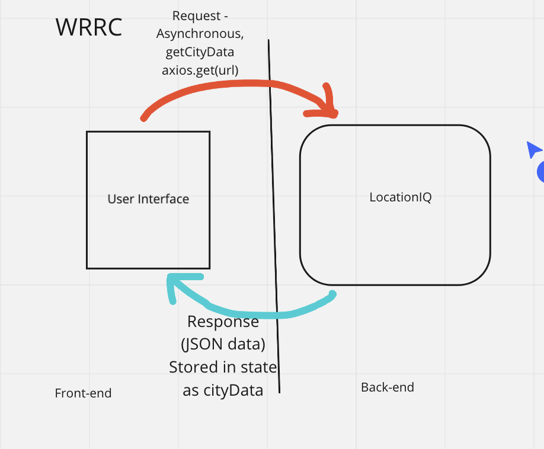
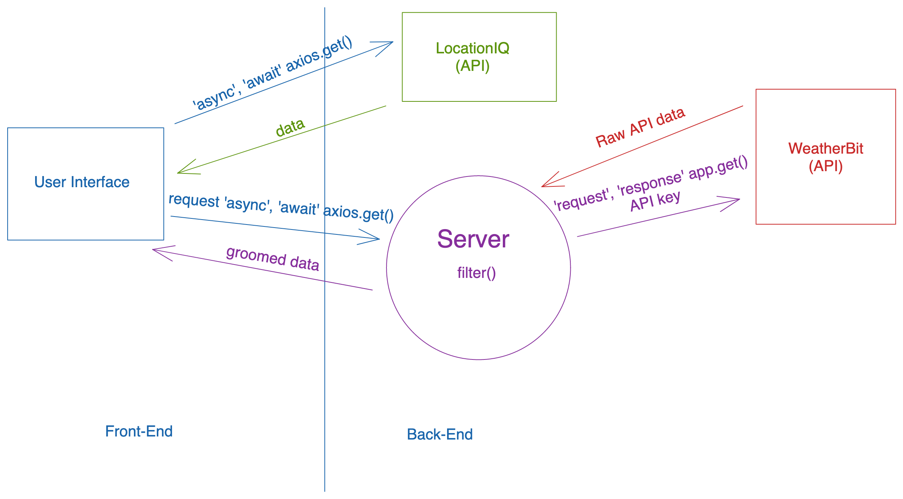
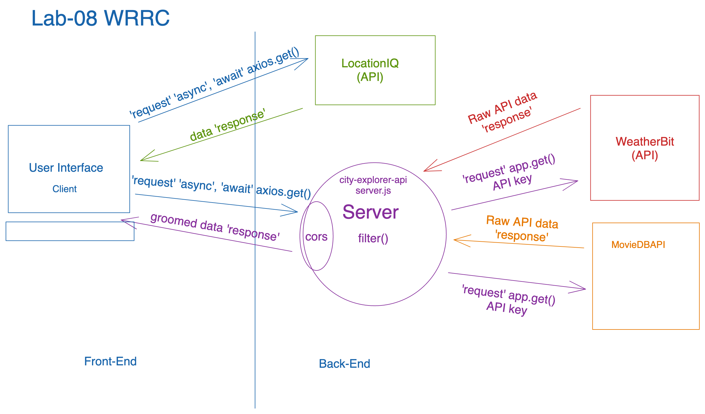
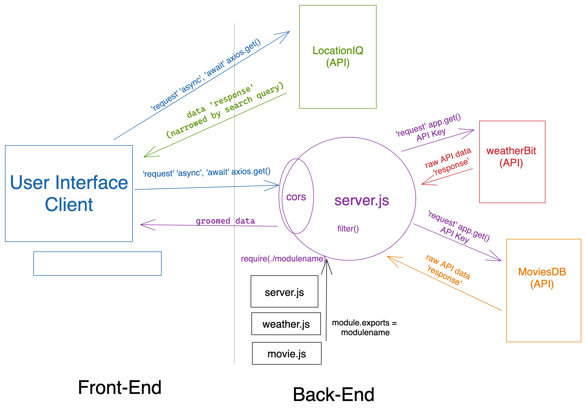
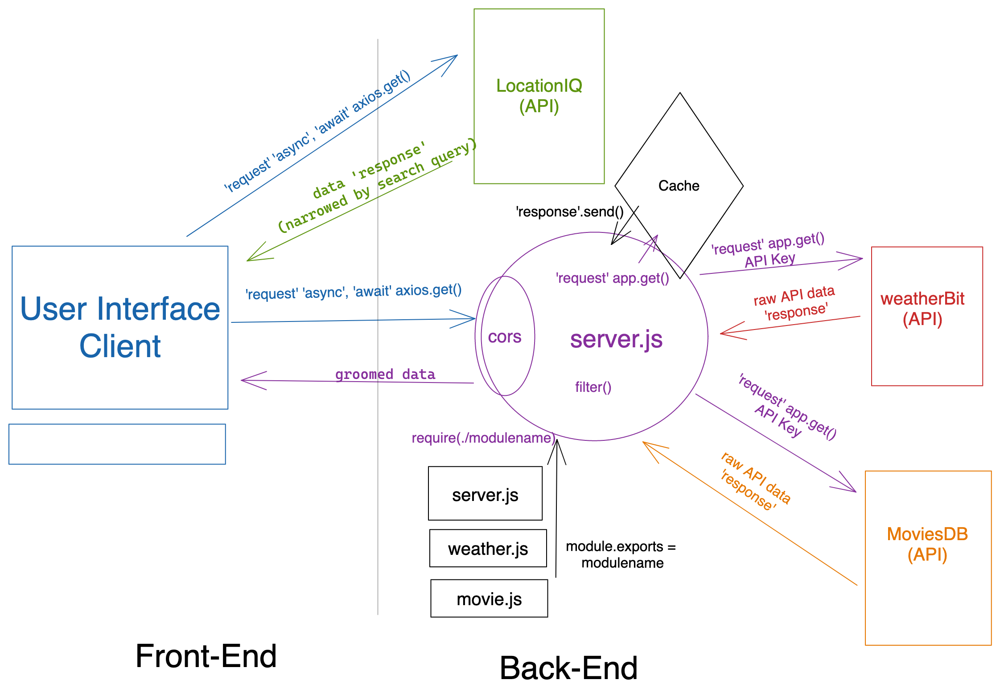

# city-explorer-api

**Author**: Brian Thornburg
**Version**: 1.0.0 (increment the patch/fix version number if you make more commits past your first submission)

## Overview
<!-- Provide a high level overview of what this application is and why you are building it, beyond the fact that it's an assignment for this class. (i.e. What's your problem domain?) -->

## Getting Started
<!-- What are the steps that a user must take in order to build this app on their own machine and get it running? -->

## Architecture
<!-- Provide a detailed description of the application design. What technologies (languages, libraries, etc) you're using, and any other relevant design information. -->

## Change Log
<!-- Use this area to document the iterative changes made to your application as each feature is successfully implemented. Use time stamps. Here's an example:

01-01-2001 4:59pm - Application now has a fully-functional express server, with a GET route for the location resource. -->
## WRRC

Lab 06 WRRC with Lauren Murphy

Lab 07 WRRC with Andres Mills Gallego

Lab 08 WRRC with Rey Mercado

Lab 09 WRRC with Matt Rangel

Lab 10 WRRC with Brady Camp

## Time Estimates

Name of feature: Set up cache

Estimate of time needed to complete: 2 hours

Start time: 3:00 p.m. CT

Finish time: 6:00 p.m. CT

Actual time needed to complete: 3 hours

## Credit and Collaborations

Andrea Mills Gallego
